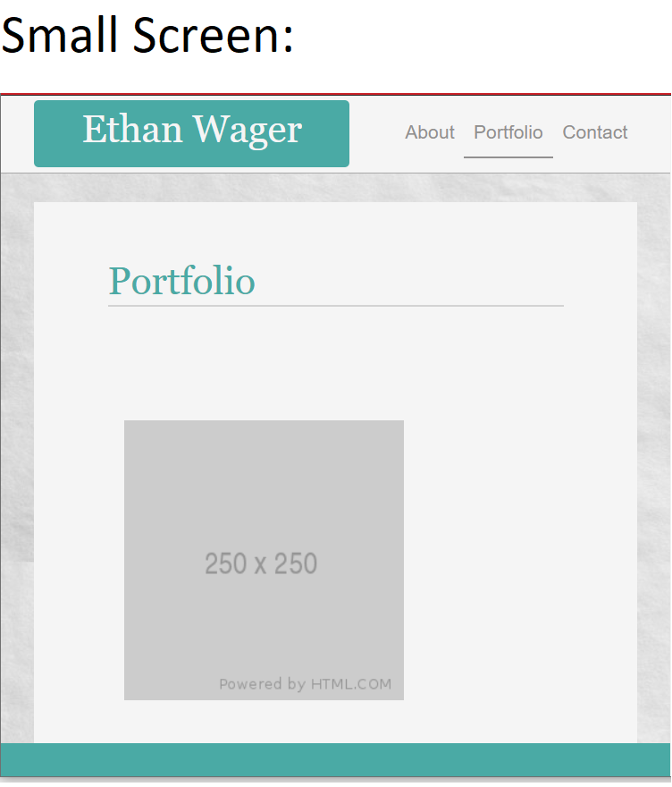
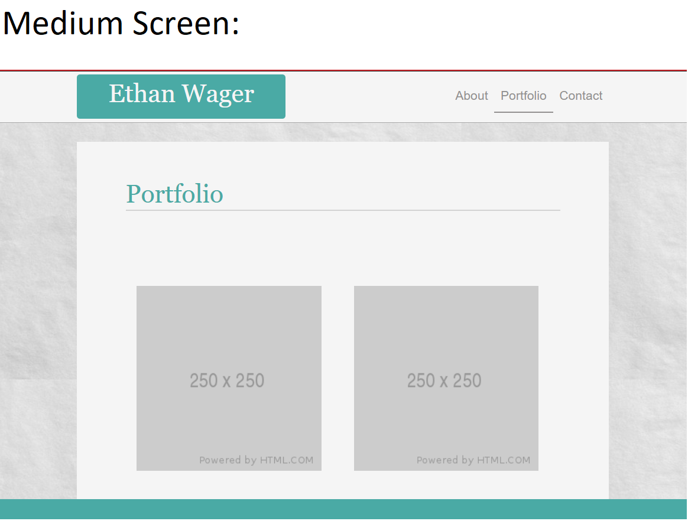
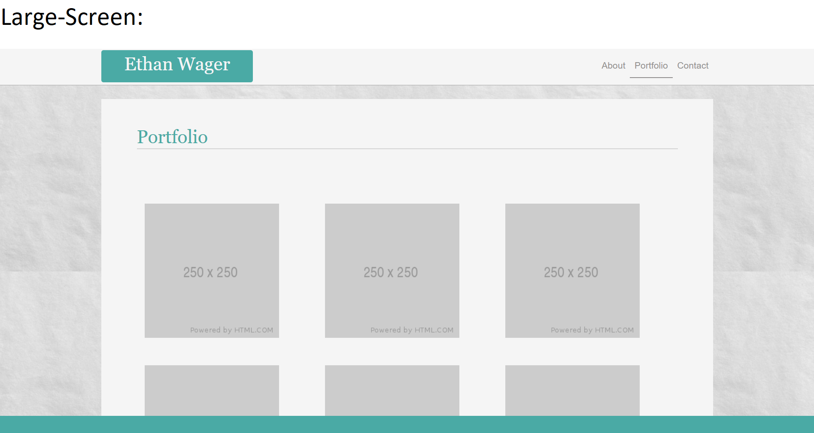
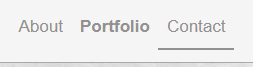
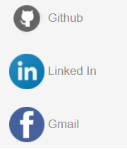

# Basic Portfolio

[My Basic Portfolio](https://ewager1.github.io/Basic-Portfolio/)

---

## Goals

To use Bootstrap CSS Framework to build a basic but professional portfolio that can display future projects

It must contain:

- A navbar

- A responsive layout

- Responsive images

- HTML validated

- Sticky footer

---

## Results

- Created a responsive website from scratch. Below are exampes of each screen size

- Mobile
  

- Small
  

- Medium
  

- Large
  

I added a few small improvements of my own

- nav anchors are underlined showing what page the user is on

- nav anchors have a .hover bold
- Created Contact image links to look more professional
- Contact image links have a .hover event that reduce opacity to 0.7 to look cooler

- Added a fancy top-hat Favicon

## New things I learned:

- How to add Boot Strap elements to my work
- How to space elements with bootstrap spacing like ml-3
- How to create responsive layouts from mobile to desktop size using things like ml-sm-3 and col-md-4
- How to create a sticky footer
- How to link icon images (Contact Section)

---
